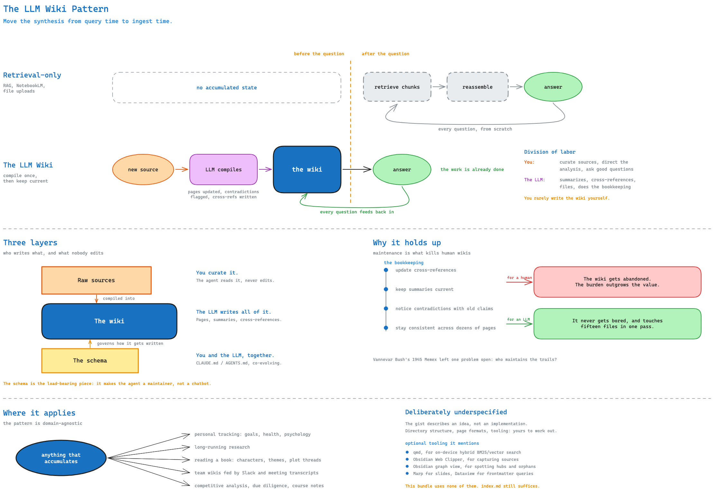

A method for building a personal knowledge base where an LLM agent — not you —
writes and maintains a structured wiki that sits between you and your raw
sources.[^karpathy-gist] This wiki is an instance of it, formalized on top of
the [Open Knowledge Format](/open-knowledge-format.md).

> [!diagram]
> Open the interactive version [here](/Diagrams/llm-wiki-pattern.excalidraw) to pan and zoom.

## The problem with retrieval-only

The default way to point an LLM at a document collection is RAG: upload files,
retrieve relevant chunks at query time, generate an answer. NotebookLM,
ChatGPT file uploads, and most RAG systems work this way.

It works, but nothing accumulates. The model rediscovers knowledge from
scratch on every question. Ask something subtle that requires synthesizing
five documents and it has to find and reassemble the same fragments it
assembled last time, with no memory that it ever did.[^karpathy-gist]

## The inversion

Instead of retrieving from raw documents at query time, the LLM **compiles**
knowledge once and then keeps it current. A new source isn't merely indexed —
it's read, and its content is integrated into the existing wiki: entity pages
updated, topic summaries revised, contradictions with earlier claims flagged,
the evolving synthesis strengthened or challenged.[^karpathy-gist]

The payoff is that the work is already done when a question arrives. The
cross-references exist. The contradictions are already surfaced. The synthesis
already accounts for everything read so far. The wiki compounds — it gets
richer with every source added *and* every question asked.

The division of labor is the point: you curate sources, direct the analysis,
and ask good questions. The LLM does the summarizing, cross-referencing,
filing, and bookkeeping. You rarely write the wiki yourself.[^karpathy-gist]

## Three layers

The pattern separates what nobody edits, what the agent owns, and what the two
of you negotiate:

| Layer | Who writes it | Role |
|---|---|---|
| **Raw sources** | You (by curation) | Immutable source of truth. The agent reads, never modifies. |
| **The wiki** | The LLM, entirely | Concept pages, summaries, comparisons, cross-references. You read it. |
| **The schema** | You and the LLM together | The config that makes the agent a disciplined maintainer instead of a generic chatbot. |

The schema is the load-bearing piece. It's an ordinary agent instruction file
(`CLAUDE.md` for Claude Code, `AGENTS.md` for Codex) describing structure,
conventions, and workflows — and it co-evolves as you learn what works for
your domain.[^karpathy-gist] In this bundle it's
[CLAUDE.md](https://github.com/ismailkhan313/tech-llm-wiki/blob/main/CLAUDE.md),
which is deliberately excluded from the published site.

The day-to-day loop over these layers — ingest, query, lint — is covered in
[wiki operations](/wiki-operations.md).

## Why it holds up

The tedious part of a knowledge base was never the reading or the thinking. It
was the bookkeeping: updating cross-references, keeping summaries current,
noticing when new data contradicts an old claim, staying consistent across
dozens of pages. Humans abandon wikis because that maintenance burden grows
faster than the value.[^karpathy-gist]

An LLM doesn't get bored, doesn't forget a cross-reference, and can touch
fifteen files in one pass. The wiki stays maintained because maintenance costs
close to nothing.

Karpathy places the idea in line with Vannevar Bush's 1945 Memex — a private,
actively curated store where the trails between documents matter as much as
the documents. Bush's unsolved problem was who maintains the
trails.[^karpathy-gist]

## Where it applies

The pattern is domain-agnostic. Karpathy's examples: personal tracking (goals,
health, psychology), long-running research, reading a book (characters,
themes, plot threads — a private version of a fan wiki like Tolkien Gateway),
team wikis fed by Slack threads and meeting transcripts, and anything else
accumulating over time — competitive analysis, due diligence, course notes,
hobby deep-dives.[^karpathy-gist]

## Deliberately underspecified

The gist describes an idea, not an implementation. Directory structure, page
formats, schema conventions, and tooling are all left to the instantiation —
the intent is that you hand the document to your agent and work out a version
that fits your domain.[^karpathy-gist] Everything in it is modular: text-only
sources need no image handling, a small wiki needs no search engine beyond
`index.md`.

Optional tooling it does mention: [qmd](https://github.com/tobi/qmd) for
on-device hybrid BM25/vector search once the index outgrows itself, Obsidian
Web Clipper for capturing sources, Obsidian's graph view for spotting hubs and
orphans, Marp for slide output, and Dataview for querying frontmatter. This
bundle currently uses none of them — the wiki is small enough that
`index.md` suffices.

[^karpathy-gist]: Andrej Karpathy, ["LLM Wiki"](https://gist.github.com/karpathy/442a6bf555914893e9891c11519de94f) (gist). Local copy: [`references/karpathy-llm-wiki.md`](https://github.com/ismailkhan313/tech-llm-wiki/blob/main/references/karpathy-llm-wiki.md).
